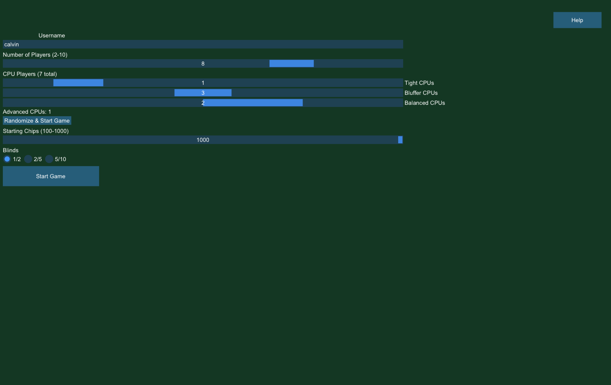
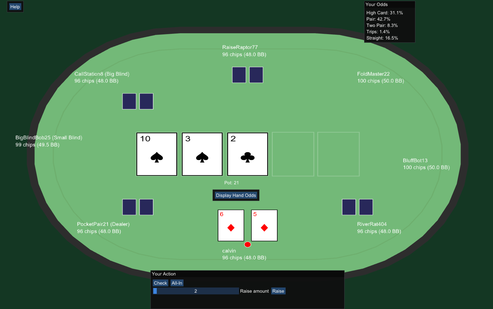

# AdaptivePoker

AdaptivePoker is a C++ poker application that evaluates hands, calculates equity, and manages full poker game sessions through a graphical interface.

## Demo




## Features

- Configurable table: 2-10 players, starting chip stack, and blind level
- Mix of CPU personalities (Tight, Bluffer, Balanced, Advanced) with a randomize-and-start option
- Evaluates poker hands and determines winners
- Live hand odds display, showing the player's chance of ending up with each hand type
- Manages players, cards, and game state across a full hand
- Handles side pots for all-in situations
- Includes debug and release build modes
- Displays cards, chip stacks, and game state through a graphical interface

## Technologies

- C++17
- CMake
- SFML 3 (Graphics, Window, System)
- Dear ImGui + ImGui-SFML

## Project Structure

- `PokerGame/` — graphical application, game session, and assets
  - `src/` — application entry point and game session glue code
  - `assets/` — card images and other visual assets
  - `tools/` — one-off asset generation utilities
- `engine/` — cards, players, hand evaluation, equity, and game logic (no dependency on SFML/ImGui)

## Build and Run

### Requirements

- C++ compiler with C++17 support
- CMake 3.22+
- SFML 3 (e.g. `brew install sfml` on macOS)

### macOS or Linux

```bash
cd PokerGame
cmake -S . -B build -DCMAKE_BUILD_TYPE=Release
cmake --build build
./build/PokerGame
```

## Build Modes

Release build:

```bash
cmake -S . -B build-release -DCMAKE_BUILD_TYPE=Release
cmake --build build-release
```

Debug build:

```bash
cmake -S . -B build-debug -DCMAKE_BUILD_TYPE=Debug
cmake --build build-debug
```

## How It Works

The project separates the poker engine from the graphical application. The engine (`engine/`) handles cards, players, game state, hand evaluation, and equity calculations, with no dependency on SFML or ImGui. The application (`PokerGame/`) links against the engine and is responsible for rendering, input, and session flow.

## What I Learned

- Structuring a larger C++ project across multiple classes
- Separating application code from core game logic
- Handling edge cases like side pots when players go all-in for different amounts

## Future Improvements

- Improving the UI
- Improving user play / interaction flow
- Additional polish and features
